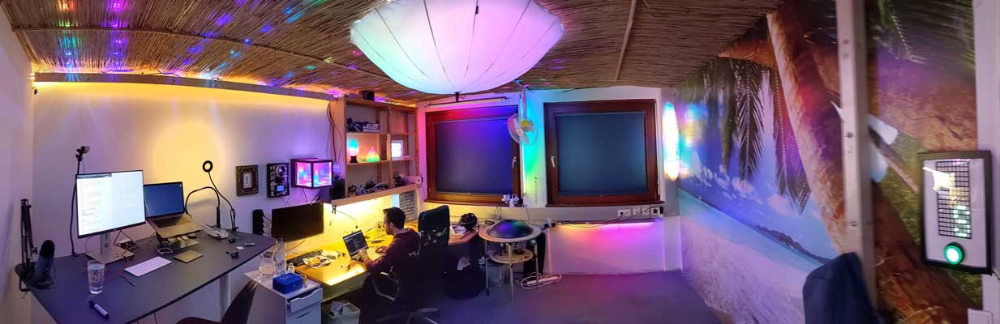
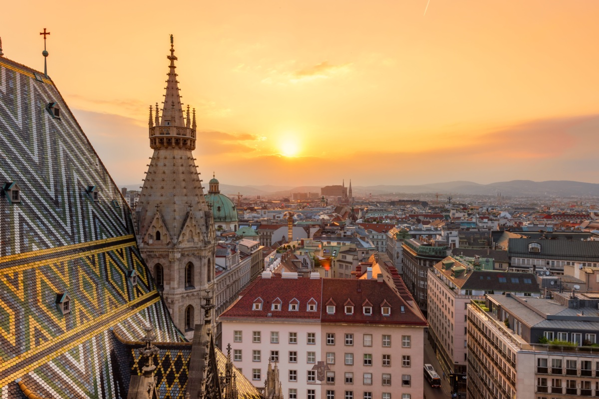
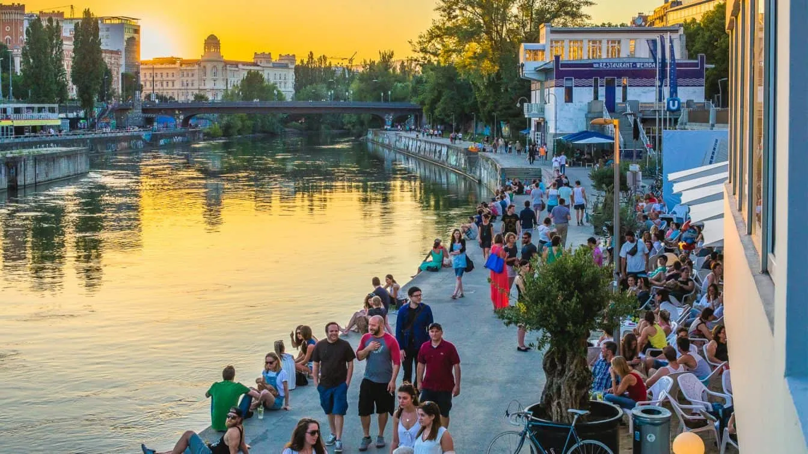

+++
title = "About Me 🥸"
slug = "about"
# hideHeader = true
+++

    

<!-- I am fascinated by technology and collaboration, endlessly curious about what is possible.
Free software advocate, participating in hacker spaces and collaborative collectives.
Dad of two little kids. -->

Hey there 👋 My name is Chris, aka metachris. I'm a builder, maker, engineer. Interested in all kinds of technology and collaboration, hacker spaces, collectives and communities.
Dad of two little kids, living in Vienna, Austria.

Mate at Flashbots :zap: :robot: 🏴‍☠️

**Reach out:**

* [chris@linuxuser.at](mailto:chris@linuxuser.at)
* [twitter.com/metachris](https://twitter.com/metachris)
* [github.com/metachris](https://github.com/metachris)
* [tg.me/metachris](https://t.me/metachris)

 <!--
**Things I'm doing:**

* Blockchain tooling, infrastructure, smart contracts
* Backend services, APIs, distributed systems
* Web, mobile, desktop, embedded
* Technical planning, building teams
* Workshops, teaching, speaking

I keep learning driven by deep curiosity.

---

**Feel free to reach out:**

* [chris@linuxuser.at](mailto:chris@linuxuser.at)
* [twitter.com/metachris](https://twitter.com/metachris)
* [github.com/metachris](https://github.com/metachris)
* [linkedin.com/in/metachris](https://www.linkedin.com/in/metachris/)

<!--

Sharing a studio with <a href="https://twitter.com/overflo">Flo Bittner</a>, in the [west of Vienna](https://www.google.com/maps/place/Kauergasse,+1150+Wien/@48.1589133,16.1941559,11.69z/data=!4m5!3m4!1s0x476da804a323a76d:0xc1e13233e0100b73!8m2!3d48.1914738!4d16.3236574):

Loving the Austrian landscape ([Lower Austria](http://maps.google.com/?q=lunz%20am%20see,%20lower%20austria) in this picture):

-->

---

Some impressions from here in Austria:

 
 

 
 

 
 

 
 

